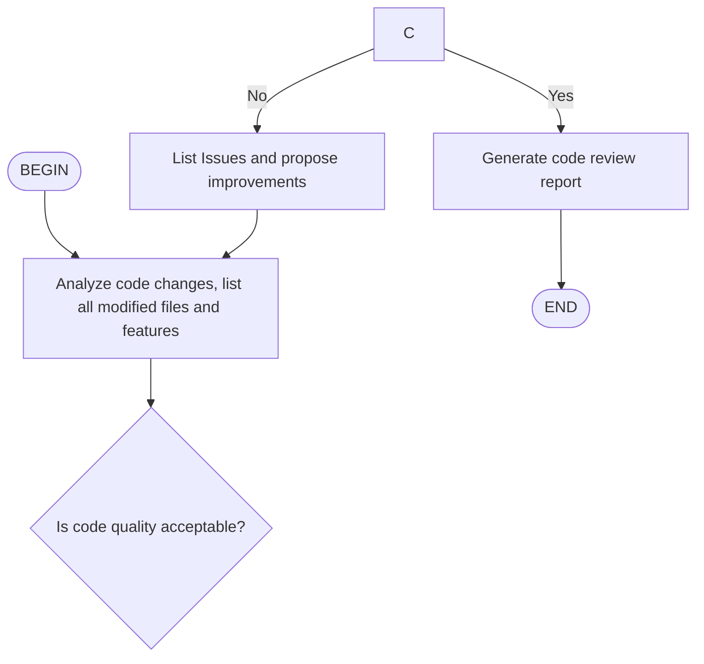

##### Skills
[Skills](https://github.com/anthropics/skills) are folders of instructions, scripts, and resources that Claude loads dynamically to improve performance on specialized tasks. Skills teach Claude how to complete specific tasks in a repeatable way, whether that's creating documents with your company's brand guidelines, analyzing data using your organization's specific workflows, or automating personal tasks.

####### Skill Sets
./skills: Skill examples for Creative & Design, Development & Technical, Enterprise & Communication, and Document Skills
./spec: The Agent Skills specification
./template: Skill template


Write a Mermaid / D2 flowchart in http://[SKILL.md](https://support.claude.com/en/articles/12580051-teach-claude-your-way-of-working-using-skills)

[Using skills in the API](https://platform.claude.com/docs/en/build-with-claude/skills-guide#creating-a-skill)

Now when you invoke /<skill-name>, the steps can be magically enforced, just like workflows. 
Agents won't lost in the middle any more.

In the meantime, agents can still understand it as usual.

#### Flow skills
Flow skills are a special skill type that embed an agent flow diagram in SKILL.md, used to define multi-step automated workflows . Unlike standard skills , flow skills are invoked via /flow:<name> commands and automatically execute multiple conversation turns following the flow diagram.

####### Creating a flow skill
To create a flow skill, set ```type: flow ``` in the frontmatter and include a Mermaid or D2 code block in the content:

```
----
name: code-review
description: Code review Workflow
type: flow
----

### Reference
-- [Claude1](https://github.com/anthropics/skills?tab=readme-ov-file)

[Claude Skills: definition, use cases, and limitations](https://portkey.ai/blog/claude-skills-definition-use-cases-and-limitations/)

[Testing Agent Skills Systematically with Evals](https://developers.openai.com/blog/eval-skills)
A practical guide to turning agent skills into something you can test, score, and improve over time.
