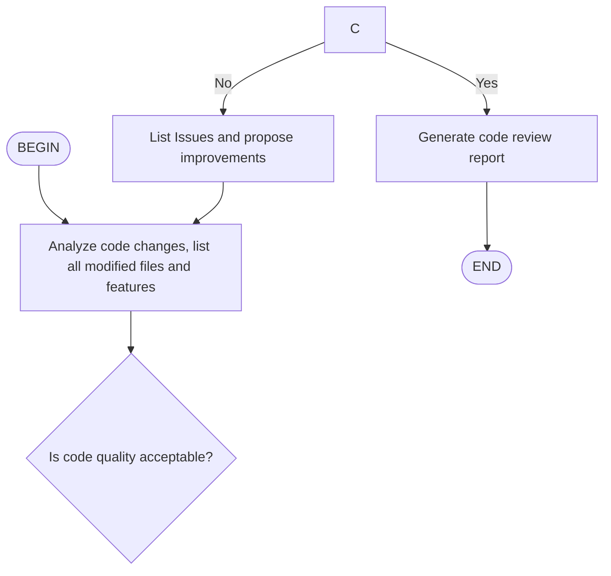

##### Skills
[Skills](https://github.com/anthropics/skills) are folders of instructions, scripts, and resources that Claude loads dynamically to improve performance on specialized tasks. Skills teach Claude how to complete specific tasks in a repeatable way, whether that's creating documents with your company's brand guidelines, analyzing data using your organization's specific workflows, or automating personal tasks.

####### Skill Sets
./skills: Skill examples for Creative & Design, Development & Technical, Enterprise & Communication, and Document Skills
./spec: The Agent Skills specification
./template: Skill template


Write a Mermaid / D2 flowchart in http://[SKILL.md](https://support.claude.com/en/articles/12580051-teach-claude-your-way-of-working-using-skills)

[Using skills in the API](https://platform.claude.com/docs/en/build-with-claude/skills-guide#creating-a-skill)

Now when you invoke /<skill-name>, the steps can be magically enforced, just like workflows. 
Agents won't lost in the middle any more.

In the meantime, agents can still understand it as usual.

#### Flow skills
Flow skills are a special skill type that embed an agent flow diagram in SKILL.md, used to define multi-step automated workflows . Unlike standard skills , flow skills are invoked via /flow:<name> commands and automatically execute multiple conversation turns following the flow diagram.

####### Creating a flow skill
To create a flow skill, set ```type: flow ``` in the frontmatter and include a Mermaid or D2 code block in the content:

```
----
name: code-review
description: Code review Workflow
type: flow
----

```mermaid
flowchart TD
A([BEGIN]) --> B[Analyze code changes, list all modified files and features]
B --> c{Is code quality acceptable?}
C --> |Yes| D[Generate code review report]
C -->|No| E[List Issues and propose improvements]
E --> B
D --> F([END])
```
### Reference
-- [Claude1](https://github.com/anthropics/skills?tab=readme-ov-file)

[Claude Skills: definition, use cases, and limitations](https://portkey.ai/blog/claude-skills-definition-use-cases-and-limitations/)

[Testing Agent Skills Systematically with Evals](https://developers.openai.com/blog/eval-skills)
A practical guide to turning agent skills into something you can test, score, and improve over time.

[claude-skills](https://github.com/dmccreary/claude-skills)
Claude Skills for Intelligent Textbooks is a comprehensive collection of AI-powered skills and workflows designed to revolutionize educational content creation. Built with Claude AI and optimized for intelligent textbook development, this repository provides educators and content creators with powerful tools to generate interactive, standards-based educational materials at scale.

[Langchain-skills](https://playbooks.com/skills/hoodini/ai-agents-skills/langchain)
This skill helps you build production-grade LLM applications using LangChain and LangGraph. It provides patterns for composing chains, RAG pipelines, agent graphs, memory, streaming, and structured outputs so you can orchestrate complex LLM workflows reliably. The examples cover LCEL composition, retriever-augmented generation, tool-using agents, and tracing with LangSmith.

[langchain-kill-1](https://playbooks.com/skills/omer-metin/skills-for-antigravity/langgraph)

[digital-brain-skill](https://github.com/muratcankoylan/Agent-Skills-for-Context-Engineering/tree/main/examples/digital-brain-skill)
Digital Brain is a structured knowledge management system designed for AI-assisted personal productivity. It provides a complete folder-based architecture for managing:

- Personal Brand - Voice, positioning, values
- Content Creation - Ideas, drafts, publishing pipeline
- Knowledge Base - Bookmarks, research, learning
- Network - Contacts, relationships, introductions
- Operations - Goals, tasks, meetings, metrics

[design-taste-frontend](https://github.com/Leonxlnx/taste-skill/blob/main/SKILL.md)
This project gives your AI (like in Antigravity, Cursor, Codex, Claude Code) good taste. It stops the AI from generating boring, generic, "slop" code and forces it to build modern, high-end interfaces.

[Agent-Skills-for-Context-Engineering](https://github.com/muratcankoylan/Agent-Skills-for-Context-Engineering/tree/main)

Antigravity Awesome Skills is a curated, battle-tested library of 930 high-performance agentic skills designed to work seamlessly across all major AI coding assistants:

- 🟣 Claude Code (Anthropic CLI)
- 🔵 Gemini CLI (Google DeepMind)
- 🟢 Codex CLI (OpenAI)
- 🟠 Kiro CLI (AWS)
- 🟠 Kiro IDE (AWS)
- 🔴 Antigravity IDE (Google DeepMind)
- 🩵 GitHub Copilot (VSCode Extension)
- 🟠 Cursor (AI-native IDE)
- ⚪ OpenCode (Open-source CLI)
- 🌸 AdaL CLI (Self-evolving Coding Agent)

[claude-skills-collection](https://github.com/abubakarsiddik31/claude-skills-collection)

A curated collection of official and community-built Claude Skills.
Anthropic Skills are modular tools that extend the capabilities of Claude AI—unlocking workflows for coding, document creation, design, data analysis, research, and more.

This repository gathers and organizes all publicly available Claude Skills, including both built-in tools by Anthropic and creative contributions from the community. Browse by category, explore capabilities, and kickstart your own Skill creation.

## Cool Articles
[Intro_skills](https://x.com/debs_obrien/status/2029269909255966977)

- Without a skill → the agent produces generic output
- With a skill → the agent follows your instructions and produces exactly what you want, every time


1. Create the folder structure

```
your-project/
└── .github/
    └── skills/
        └── good-morning/
```
2. Create the SKILL.md file

```
your-project/
└── .github/
    └── skills/
        └── good-morning/
            └── SKILL.md
```
Step 3: Add the frontmatter(yaml)

Open `SKILL.md` and add the YAML frontmatter at the top:

```md
---
name: good-morning
description: A skill that responds to good morning with a cheerful greeting
---
```

Two important things here:

1. The name must match the folder name.  If the folder is called `good-morning`, the name must be `good-morning`. If they don't match, your editor will flag it.

2. The name and description are always in context. Every time you're working in this project, the agent sees the name and description so it knows what skills are available. Keep the description short and specific, this is how the agent knows when to use the skill.

Step 4: Write the instructions

Everything below the frontmatter is the skill body. This only gets added to context when the skill is called, not all the time. The agent only loads these instructions when it decides to use the skill.
Add the body below the frontmatter:

```md
---
name: good-morning
description: A skill that responds to good morning with a cheerful greeting
---

# Good Morning Skill

When the user says good morning, respond with:

- "Hi Debbie, hope you have a great day!"
- Ask if they have done any sport today
- Include a funny joke about sports
```

```
Example
User: Good morning
Agent: Hi Debbie, have you done any sport today? Here's a funny joke about sports: Why did the soccer player bring string to the game? Because he wanted to tie the score!
That's the complete skill. One file. A few lines of instructions. Make it as personal as you like, put your own name in there, change the topic from sports to whatever you want.
```

### Test it
```
Start a new session from the same directory (skills are discovered at session start) and type:
> Good morning
The agent finds the skill, reads the `SKILL.md` file, and responds.
In GitHub Copilot: "Hi Debbie, have you done any sport today? Here's a funny joke about sports: Why did the bicycle fall over? Because it was too tired from all that cycling!"
In Claude Code: Open Claude Code from the same project directory, say "good morning", and you get the same thing: "Hi Debbie, have you done any sport today? Here's a funny joke for you: Why do basketball players love donuts? Because they can always dunk them!"
Skills work across agents. The same `SKILL.md` file works in Copilot, Claude Code, and others. Each agent discovers the skill, reads the instructions, and follows them.
That's a skill in action. Now imagine instead of "good morning", the instructions told the agent how to generate a polished README, write commit messages in your team's format, or review code against your standards. Same idea, bigger impact.

```

### How skills get loaded
Skills are designed to be efficient with context windows. They use a three-level loading system. The agent only loads what it needs, when it needs it.


- Level 1 is always in the agent's context. It's just the name and description (~100 words). This is how the agent decides whether to use the skill. If someone says "improve my README", the agent scans its available skills and picks the one whose description matches.
- Level 2 loads when the skill triggers. The full SKILL.md body with all the instructions, steps, and examples. This is ideally under 500 lines.
- Level 3 loads on demand. Scripts, references, and assets that the agent pulls in only when it needs them. Scripts can even run without being loaded into context at all, saving tokens. And some resources might not load at all for certain projects. For example, a diagram template file only needs to be read if the project is complex enough to need an architecture diagram. Simple projects skip it entirely.

###Where skills live
Skills can be installed at two levels:

- Project-level: in your project directory, available only when you're in that directory
Global: in your home directory, available from anywhere
```
GitHub Copilot (VS Code):
Project-level (any of these work)
your-project/.github/skills/
your-project/.claude/skills/
your-project/.agents/skills/
```
Personal (works from any directory)
```
~/.copilot/skills/
~/.claude/skills/
~/.agents/skills/
```
Claude Code:
Project-level
```
your-project/.claude/skills/
```
Personal (works from any directory)
```
~/.claude/skills/
```
The `.agents/skills/` path is part of the Agent Skills open standard which is a cross-tool standard, but Claude Code uses its own `.claude/` directory structure, not `.agents/`.

### The skills ecosystem

There's a whole directory of skills at skills.sh where you can browse and discover skills built by the community.
To install a skill, use the skills CLI:

```
npx skills add anthropics/skills --skill skill-creator
```
This installs the `skill-creator` skill from Anthropic. A skill that helps you create other skills. One command and it's ready to use.
You can see what you have installed:
```
npx skills list
```
And search for skills:
```
npx skills find
```

#### References

- [langchain-skills](https://github.com/langchain-ai/langchain-skills/tree/main)

Agent skills for building agents with LangChain, LangGraph, and Deep Agents.


#### Cool Articles

[Practical Guide to Evaluating and Testing Agent Skills](https://www.philschmid.de/testing-skills)

Agent Skills are folders of instructions, scripts, and resources that augment an agent's capabilities without retraining or fine-tuning the model. Skills follow a progressive disclosure pattern and require at minimum a SKILL.md file with:

- Frontmatter (trigger): A name and description in YAML that the agent uses to decide whether to apply the skill. This is the most important piece — if it's vague, the skill won't trigger reliably.
- Body (instructions): Markdown guidance for how to perform the task: what APIs to use, what patterns to follow, what to avoid.
- Resources (optional): scripts/, examples/, references/ that the agent can consult during execution.

```md
---
name: gemini-interactions-api
description: Use this skill when writing code that calls the Gemini API
  for text generation, multi-turn chat, image generation, streaming responses,
  function calling, structured output, or migrating from generateContent SDK.
---
 
# Gemini Interactions API Skill
 
The Interactions API is a unified interface for interacting with Gemini models
and agents...
```


Skills fall into two categories that matter for testing:

- Capability skills help the agent do something the base model can't do consistently. These may become unnecessary as models improve; evals will tell you when that's happened.
- Preference skills document specific workflows. These are durable, but only as valuable as their fidelity to your actual workflow, and evals verify that fidelity.


#### Define Success Before You Write the Skill
Before writing a single eval, write down what "success" means in measurable terms. Grade outcomes, not paths. Agents find creative solutions, and you don't want to penalize an unexpected route to the right answer.

- Outcome: Did the skill produce a usable result? Code compiles, the image rendered, the document got created, the API returned a valid response. This is the baseline. If the output doesn't work, nothing else matters.
- Style & Instructions: Does the output follow your conventions and the skill's directives? Right SDK, correct model IDs, team's naming conventions, the formatting you specified.
- Efficiency: How much time, tokens, and effort did it take? No unnecessary retries, reasonable token count, no command thrashing. This is the most undervalued dimension. Two runs can produce identical correct output, but one burned 3x the tokens. Regressions here are real costs that compound.

