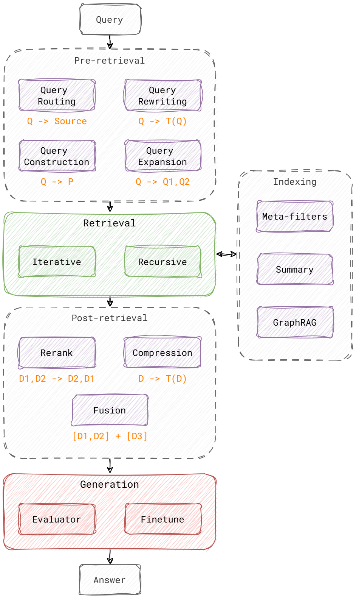

# Examples of Advanced RAG techniques



This repo contains a list of Jupyter notebooks with examples and explanations of different RAG techniques. The idea behind the examples is to be used as a sort of toolbox to be used when developing LLM applications with RAG.

The examples will use a mix of [LlamaIndex](https://docs.llamaindex.ai/en/latest/) and some more basic approaches.
The basic approaches are used to explain the steps behind a specific technique and therefore not specifically optimized and thus not necessarily meant to be used in a production environment.

## Setup (using Anaconda)

Download and run installer for [Anaconda3](https://repo.anaconda.com/archive/)

You may need to [initiate](https://docs.conda.io/projects/conda/en/latest/dev-guide/deep-dives/activation.html) Conda for your terminal:

```bash
conda init [bash|zsh|fish|powershell]
```

Create and activate new environment. Python should be version 3.11.6, since some packages might fail to install in Python 3.12+

```bash
conda create -n advanced-rag-env -y -c conda-forge python==3.11.6 ipython
conda activate advanced-rag-env
```

Install Jupyter Lab

```bash
conda install -c conda-forge jupyterlab
```

Install base dependencies. These are common dependencies for all notebooks.

```bash
pip install -r requirements.txt
```

or

```bash
conda install --yes --file requirements.txt
```

If the different notebooks need specific dependencies they might require you to run pip install for specific requirement files. This will be specified in each notebook.

## Run

Using [Jupyter Lab](https://jupyterlab.readthedocs.io/en/stable/getting_started/overview.html)

```bash
jupyter lab
```

## Notebooks

The notebooks are ordered  to fit with the typical Sequential Pattern for Advanced RAG of 

*Indexing -> Pre-Retrieval -> Retrieval -> Post-Retrieval -> Generation*


- [01 - Baseline RAG Example](./baseline-rag.ipynb)
- [02 - Chunking](./chunking.ipynb)
- [03 - Query Rewriting](./query-rewriting.ipynb)
- [04 - Query Routing](./query-routing.ipynb)
- [05 - Retrieval](./retrieval.ipynb)
- [06 - Post-Retrieval](./post-retrieval.ipynb) ]
- [07 - RAG Fusion](./rag-fusion.ipynb)
- [08 - Fine-Tuning](./fine-tuning.ipynb) (Work in progress)
- [09 - Evaluating RAG](./evaluation.ipynb)
- [10 - Advanced RAG Example](./advanced-rag.ipynb)